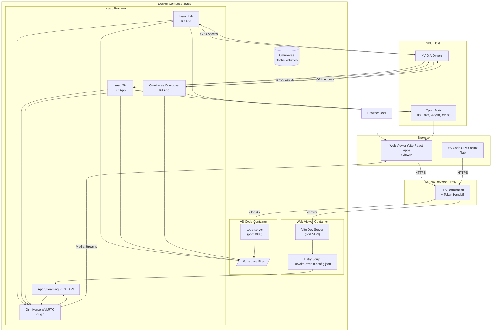

# Launchable Isaac Lab / Isaac Sim Stack Flowchart

This diagram outlines the key services, how they are orchestrated via Docker Compose, and the interaction path from the end user through the nginx proxy to the Isaac applications and WebRTC streaming components.
